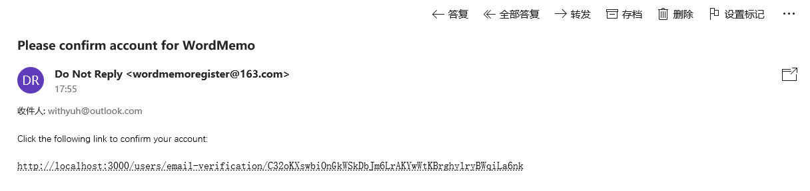
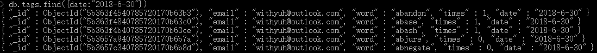

# WordMemo

[TOC]

## 设计文档

###项目概述

####1.1 项目说明

本项目实现了一个可供用户个性化定制的单词学习网站。

主要功能包括：

* 用户邮箱注册、登陆
* 用户个性化设置，包括选择要背的单词集、设定每日新词数、是否显示英文释义。
* 用户个人单词集
* 个性化背诵计划、复习、考核
* 界面样式适配 PC 和手机浏览器
* 按照艾宾浩斯记忆曲线调整学习内容

网站前端主要使用Bootstrap+jQuery框架实现，使用Bootstrap的响应式布局，能够在多种分辨率下自适应地调整导航栏和内容分布。在页面渲染上选择前端渲染与服务端渲染相结合的方式，后端使用EJS模板引擎进行渲染。

网站后端主要用于给客户端提供访问数据库的接口，在本项目中使用Node.js Express框架实现。 

使用MongDB数据库提供数据存储服务。

#### 1.2 开发运行环境

- 操作系统：Windows 10
- 服务器软件：Node.js 8.9.4及以上
- 逻辑数据库：MongoDB 3.0.9及以上

#### 1.3 部署说明

由于没有个人服务器，网站在开发和测试阶段都在本地运行，以下为部署说明：

1. 更改配置文件config.ini

   ```
   [mongo]
   db_host = 服务器主机地址
   db_user = Mongo用户名
   db_pass = 密码
   db_name = wordmemo
   db_port = MongoDB服务器端口
   ```

2. 运行 loadData.py

3. 后台运行 refresh.py

4. 进入服务器所在目录 WordMemo，根据各个服务器配置，按如下说明更改配置文件config.json：

```
{
  "host": "服务器主机地址",
  "port": "服务器主机端口",
  "mailoptions": {
    "service": "邮件服务",
    "email": "邮箱账号",
    "password": "邮箱密码"
  },
  "database": {
    "host": "MongoDB数据库服务器地址",
    "port": "MongoDB服务器端口",
    "user": "Mongo用户名",
    "password": "密码"
  },
}
```

3. 安装Node.js依赖包：

```
npm install
```

4. 启动服务器

```
npm start
```

### 总体设计

#### 2.1 总体架构

网站总体架构如下图所示：


#### 2.2 主要源代码结构

├── config.ini 数据库配置文件

├── loadData.py 单词导入数据库

├── refresh.py 后台常驻进程，数据库定时任务

├── WordMemo 

|    ├── app.js Node.js入口脚本 

|    ├── bin 服务器启动脚本 

​|    ├── config.json 网站配置文件（服务器地址，数据库源等） 

|    ├── package.json Node.js依赖模块声明 

​|    ├── public 网站静态文件 

|    ├── routes Node.js路由 

|    ├── scripts 网站后端逻辑实现 

|    └── views 网站前端实现 

#### 2.3 前端

前端主要使用Bootstrap+jQuery框架实现，使用Bootstrap的响应式布局，能够在多种分辨率下自适应地调整导航栏和内容分布。在页面渲染上选择前端渲染与服务端渲染相结合的方式，后端使用EJS模板引擎进行渲染。 

样式表主要使用了 [Zerotheme](https://www.zerotheme.com/) 的开源模板。

* 主要界面
  * 主页 Home
  * 注册登陆 Register / Sign in
  * 学习 Start Learning
  * 单词书选择 Vocabulary List
  * 自定义单词集 My Word Bank
  * 学习进度 Learning Schedule
  * 设置 Settings
  * 释义界面 review.ejs
  * 测试界面 test.ejs

#### 2.4 后端

网站后端主要用于给客户端提供访问数据库的接口，在本项目中使用Node.js Express框架实现。 

* 主要接口

  * 用户注册(发送认证邮件) 

    * URL：/users/register 

    * Method：POST 

    * 参数

      |   参数   |  类型  |  说明  |
      | :------: | :----: | :----: |
      |  email   | String |  邮箱  |
      | password | String |  密码  |
      | username | String | 用户名 |

  * 用户登陆

    - URL：/users/register 

    - Method：POST 

    - 参数

      |   参数   |  类型  | 说明 |
      | :------: | :----: | :--: |
      |  email   | String | 邮箱 |
      | password | String | 密码 |

  * 更改设置

    - URL：/users/settings

    - Method：POST 

    - 参数

      |    参数     |  类型   |       说明       |
      | :---------: | :-----: | :--------------: |
      |  numPerDay  | Number  |    每日新词数    |
      | showEnglish | Boolean | 是否显示英文释义 |

  * 添加到自定义单词集

    - URL：/users/add

    - Method：POST 

    - 参数

      |  参数  |  类型  |      说明      |
      | :----: | :----: | :------------: |
      | myWord | String | 需要添加的单词 |

  * 开始学习，获取今日单词

    - URL：/learn
    - Method：GET
    - 参数：无

  * 测试模式

    - URL：/test
    - Method：GET
    - 参数：无

  * 释义模式

    - URL：/review
    - Method：GET
    - 参数：无

  * 获取下一个单词

    - URL：/next
    - Method：GET
    - 参数：无

  * 打开我的单词集

    - URL：/wordbank
    - Method：GET
    - 参数：无

  * 打开单词书选择界面

    - URL：/voclist
    - Method：GET
    - 参数：无

  * 更改单词书

    - URL：/changebook

    - Method：POST

    - 参数：

      | 参数 |  类型  |      说明      |
      | :--: | :----: | :------------: |
      | book | String | 选择的单词书名 |

  * 显示词条释义

    - URL：/explanation_bank

    - Method：POST

    - 参数：

      | 参数  |  类型  |        说明        |
      | :---: | :----: | :----------------: |
      | count | Number | 在单词列表中的索引 |

#### 2.5 数据库

* db：wordmemo

* collections：

  * users：存储用户信息

    |     字段       |  类型   | 说明 |
    | :-----------: | :-----: | :--: |
    |     email     | String  | 邮箱 |
    |   password    | String  | 密码 |
    |   username    | String  | 用户名 |
    |   learnBook   | String  | 单词书 |
    | wordNumPerDay | Number  | 每日新词数 |
    |  showEnglish  | Boolean | 是否显示英文释义 |
    |  todayWords   |  Array  | 今日学习单词集 |
    | todayLearned  | Number  | 今日已学习数 |
    | todayMastered | Number  | 今日已掌握数 |
    |   wordBank    |  Array  | 我的单词集 |
    |  wordToLearn  |  Array  | 新词集 |
    | wordLearning  |  Array  | 正在学习单词集 |
    |   mastered    | Number  | 已完全掌握单词数 |

  * words：存储所有单词及其中英文释义

    |  字段   |  类型  |   说明   |
    | :-----: | :----: | :------: |
    |  word   | String |   单词   |
    | chinese | String | 中文释义 |
    | english | String | 英文释义 |

  * books：存储单词书信息

    |  字段  |  类型  |     说明     |
    | :----: | :----: | :----------: |
    |  name  | String |     书名     |
    | number | Number | 包含单词总数 |
    |  word  | Array  | 包含单词列表 |

  * tags：存储单词复习信息

    | 字段  |  类型  |      说明      |
    | :---: | :----: | :------------: |
    | word  | String |      单词      |
    | email | String |      邮箱      |
    | times | Number |   已复习次数   |
    | date  | String | 下一次复习时间 |

### 模块设计

#### 3.1 用户注册登陆模块

* 注册

  用户可以通过个人邮箱进行账户注册。该部分主要涉及到信息验证和邮箱认证两部分内容。

  * 信息验证

    信息验证主要包括用户名、密码要求在6字节以上，email的格式验证，以及email在系统中的唯一性验证。

    保证用户名、密码要求在6字节以上可以直接检查返回的对应字符串长度，email的格式验证可以通过简单的正则表达式匹配实现：

    ```js
    	if (user.username.length < 6) {
            // error info, omit here
            return;
        }
        if (user.password.length < 6) {
            // error info, omit here
            return;
        }
        let reg = /^([a-zA-Z0-9]+[_|\-|\.]?)*[a-zA-Z0-9]+@([a-zA-Z0-9]+[_|\-|\.]?)*[a-zA-Z0-9]+\.[a-zA-Z]{2,3}$/gi;
        if (!reg.test(user.email)) {
            // error info, omit here
            return;
        }
    ```

    Email在系统中的唯一性检查将在下一节的邮箱认证中一起完成。

  * 邮箱认证

    邮箱认证主要使用Node.js的email-verification模块。

    首先配置一个用于发送认证邮件的邮箱。为了集中服务器的配置信息，将所有的配置统一放在服务器根目录下的config.json文件中：

    ```json
    {
      ...
      "mailoptions": {
        "service": "163",
        "email": "wordmemoregister@163.com",
        "password": "wordmemo2018x"
      },
      ...
    }
    ```

    邮箱相关的配置统一放在mailoptions字段中，其中email，password项分别为账号密码，service为使用的邮件服务提供商（[可选用的服务列表](https://nodemailer.com/smtp/well-known/)）。

    编写脚本配置email-verification模块，包括认证邮件的标题、正文格式，邮件激活链接格式，发送邮箱的地址、密码等等：

    ```js
    nev.configure({
        verificationURL: 'http://' + config["host"] + ':' 
        	+ config["port"] + '/users/email-verification/${URL}',
        persistentUserModel: User,
        tempUserCollection: 'wordmemo_tempusers',
        transportOptions: {
            service: mailOption["service"],
            auth: {
                user: mailOption["email"],
                pass: mailOption["password"]
            }
        },
        verifyMailOptions: {
            from: 'Do Not Reply ' + mailOption["email"],
            subject: 'Please confirm account for NewsFeed',
            html: 'Click the following link to confirm your account:</p><p>${URL}</p>',
            text: 'Please confirm your account by clicking the following link: ${URL}'
        },
        confirmMailOptions: {
            // same format as verify MailOptions
        },
        hashingFunction: myHasher
    }, function (err, options) { ... })
    ```

    当用户注册时，需要创建一个临时用户并保存到数据库中（默认设置为1天过期），直到用户点击认证链接时才将临时用户转为正式用户。通过MongoDB的ORM模块mongoose，定义用户实体在数据库中的逻辑字段以及密码加密方式(使用bcrypt模块,进行加密，使用的算法是[Blowfish加密算法](https://zh.wikipedia.org/wiki/Blowfish_(%E5%AF%86%E7%A0%81%E5%AD%A6)))：

    ```js
    var userSchema = mongoose.Schema({
        email: String,
        password: String,
        username: String,
        ...
    });
    
    userSchema.methods.validPassword = function (pw) {
        return bcrypt.compareSync(pw, this.password);
    };
    ```

    创建临时用户时检查邮箱名在数据库中是否唯一，若数据库已经存在该邮箱则注册失败：

    ```js
    nev.createTempUser(user, function (err, existingPersistentUser, newTempUser) {
     	    // other errors ...
            // user already exists in persistent collection
            if (existingPersistentUser){
                res.render("info", {
                    title: "Notice",
                    message: 'Email Already Exists'
                });
                return;
            }
            // a new user
            if (newTempUser) {
                var URL = newTempUser[nev.options.URLFieldName];
                nev.sendVerificationEmail(user.email, URL, function(err, info) { ... });
            }
        })
    ```

    最后，实现当用户成功点击邮件中的认证链接时，将临时用户转为正式用户的处理逻辑：

      ```js
      router.get('/email-verification/:url', function (req, res) {
          let url = req.params.url;
          nev.confirmTempUser(url, function (err, user) {
              if( err ){ ... } else {
                  nev.sendConfirmationEmail(user.email, function (err, info) {
                      if( err ){ ... } else {  // email verification successful
                          // automatically login
                          req.session.user = user
                          res.redirect('/')       // redirect to home page
    					...
      ```

* 登陆

  用户输入邮箱名和密码后，向数据库Users表中查找记录，若邮箱及密码均匹配，则令当前req.session.user为用户登陆的账号，并更改导航栏的显示。这里涉及到用户状态如何维护的问题。

  * 用户状态维护

    用户状态维护可以简单的使用cookie，但cookie所有数据在客户端就可以被修改，数据非常容易被伪造，而且如果 cookie 中数据字段太多会影响传输效率。为了解决这些问题，就产生了 session，session 中的数据是保留在服务器端的，因此网站使用比cookie更安全的session保存用户状态，node中也提供了非常方便的express-session模块来读写session。

    网站接入session非常方便，只需要在app.js文件中配置express-session选项：

    ```js
    app.use(session({
        secret: randomstring.generate({
            length: 128,
            charset: 'alphabetic'
        }),
        cookie: {
            maxAge: 60000*1000
        },
        resave: true,
        saveUninitialized: true
    }));
    ```

    之后便能够通过访问每个express请求中session字段即可访问session对象。注意到由于session仍然需要在浏览器端存储一个随机生成的字符串session-id，因此需要指定cookie的有效时间，目前默认设置为100分钟，即用户登录100分钟后需要重新登录。

#### 3.2  个性化模块

* 单词书选择

  在用户开始学习之前，必须首先选择要学习的单词书，目前仅支持GRE和TOEFL词汇的学习。选择单词书之后，首先会将书名存储到相应用户记录的learnBook字段，然后根据书名到Books表中获取该书的所有单词，并存储到用户的wordToLearn列表。

  ```js
  router.post('/changebook', function (req, res, next) {
      req.session.user.learnBook = req.body.book;
      User.updateBook([req.session.user.email, req.session.user.learnBook]);
      Book.getBookInfo(req.session.user.learnBook, function (err, result) {
          req.session.user.wordToLearn = result['word'];
          User.insertWordToLearn([req.session.user.email, req.session.user.wordToLearn]);
      });
      res.render('changebook', {
          title: 'Word Book'
      })
  });
  ```

* 学习设置

  用户可以设置每日学习新词数，以及是否在学习时显示英文释义。在Settings界面输入相应设置更改后首先检查输入是否合法，每日新词数为在[1, 1000]之间的整数，是否显示英文释义为true或false。之后更改当前用户的wordNumPerDay字段和showEnglish字段。

* 个人单词集

  在学习过程中，用户可以将单词加入自己的个人单词集，即将单词加入用户的wordBank列表中。在My Word Bank界面会显示用户的所有个人单词集单词，点击单词条会跳转到具体的单词释义界面。

#### 3.3 背诵复习考核计划模块

用户在登陆并且进入学习界面后，会从用户的wordToLearn列表中选取一定数量的单词，并放入用户的todayWords列表中。

* 单词学习规则

  每个单词有如下四种状态：

  - 新词：用户从未见过的词库中的单词，存储在用户的wordToLearn列表
  - 正在学习的单词：用户见过但未掌握的单词，即在学习过程中选择了“不认识”。存储在用户的wordLearning列表
  - 需要复习的单词：用户掌握但复习次数少于5的单词，存储在Tags表中
  - 完全掌握的单词：在单词连续复习五次都掌握之后，单词将被标记为完全掌握，不再出现在学习中

  他们的状态转化如下图所示：

  

  (1) 每天会从用户wordToLearn列表中pop出一定数量的单词，放入wordLearning列表，作为正在学习的单词。

  (2) 在学习过程中，每个单词显示之后有“认识”和“不认识”两个选项，若对同一个单词连续两次遇到之后都选择“认识”，则该单词被标记为当日掌握的单词，不会在当日的学习中再次出现，而是转换为需要复习的单词，并且在Tags表中更新该条记录（存储单词，用户，复习次数，下一次复习时间信息），根据艾宾浩斯曲线在之后进行复习，关于复习将在之后的章节中具体阐述。同时该单词会被移出wordLearning列表。

  (3) 需要复习的单词，在连续五次复习中都掌握，则该单词转换为完全掌握的单词，不再出现在学习中。

* 每日单词的选择

  每日单词的数目是动态确定的，主要由新词，正在学习的单词，需要复习的单词三部分组成。

  他们的关系如下：
  $$
  新词数 + 正在学习单词数 + 复习单词数 = 每日单词数\\
  新词数 + 正在学习单词数 = wordNumPerDay \\
  新词数 ： 正在学习单词数 = 3：7
  $$
  按照比例，新词直接从wordToLearn中取出；正在学习的单词从wordLearning中取出。而需要复习的单词从Tags表中查询date字段为当天且email为当前用户的所有单词并取出。

* 复习规划

  复习主要根据艾宾浩斯曲线，在单词第一次被标记为当日掌握之后的第一、二、四、七、十五天之后进行复

  习。

  

  每次用户在当天掌握该单词之后，会更新Tags表中相应用户单词的times和date字段，times表示复习次数，date表示下一次复习时间。

  时间获取使用 Js 的 Date 方法：

  ```js
  // days is the time interval from now to the next review time
  let date =  new Date();
  date.setDate(date.getDate() + days);
  let month = date.getMonth() + 1;
  dateStr = date.getFullYear()+'-'+ month +'-'+ date.getDate();
  ```

  若复习当天单词未被掌握，会在下一天继续安排该单词的复习。

* 学习进度

  学习进度主要记录 Learning Words（正在学习单词数），Total Words（总单词数），Completed Words（完全掌握单词数），Will Complete After（预计学习完成时间）。预计学习完成时间主要通过总单词数除以每日单词数再加上一个单词的总复习时间（15天）计算得到。
  $$
  Will CompleteAfter = \frac{Total Words}{wordNumPerDay} + ReviewTime
  $$


#### 3.4 单词导入模块

词库主要由GRE和TOEFL单词组成.。网上能下载到的多为Excel或Word版本的单词，包括单词，单词中文释义以及单词英文释义，首先将其转换为JSON格式，然后通过pymongo导入数据库。

```python
collection = getConnection('mongo')['words']
collection.create_index('word', unique=True)
collection.insert(result_words)
```

单词书通过同样的方法导入，主要包括单词书名，单词数，即包含的单词列表。

#### 3.5 数据库定时任务模块

每天00:00时，服务器会清除每个用户的todayWords，todayMastered，todayLearned字段。这里主要使用python的schedule模块执行周期性操作，该模块提供了非常人性化的接口，如调用`schedule.every().day.do(updateModel)`便可以从调用时刻开始每隔一天执行一次updateModel函数，其中day也可以换成hour，minute等时间单位。通过这些接口就能够很方便地实现周期性调用的功能。数据库定时任务脚本的主要实现代码如下： 

```python
def refresh_database():
    print("refresh...")
    user_col = getConnection('mongo')['users']
    user_col.update({}, {'$set': {'todayWords': [], 'todayLearned': 0, 'todayMastered': 0}})
```

```python
schedule.every().day.at("00:00").do(refresh_database)
    while True:
        schedule.run_pending()
        time.sleep(1)
```

## 使用手册

- 主页 Home

  主页包括上方的导航栏，网站服务介绍栏，网站信息介绍栏以及反馈栏。

  导航栏可以选择跳转到其他界面，包括登陆Sign in，学习 Start Learning，单词书选择 Vocabulary List，自定义单词集 My Word Bank，学习进度 Learning Schedule，设置 Settings。但在未登录状态只能访问主页，若需访问其他界面需先登陆。

  网站服务介绍栏主要介绍网站的特性。

  网站信息介绍栏包括网站名的由来以及网站的基本功能介绍。

  反馈栏可以填写用户的反馈意见，以帮助我们更好的改进网站。

  

- 注册登陆 Register / Sign in

  点击登陆（Sign In），即进入登陆界面，如下图所示：

  

  输入邮箱，密码即可登陆，登陆后网站会自动跳转到主页，且在导航栏显示当前用户状态：

  

  若还没有账户，可以点击下方的Register a new accout进行账户注册，要求用户名，密码不能少于6字节：

  

  若信息填写正确，服务器会发送验证邮件到用户注册的邮箱中去，如下图所示：

  

  点击链接即可自动跳转到网站主页，并且自动登陆。

- 单词书选择 Vocabulary List

  在开始学习前，需先选择要学习的单词书，如下图所示，可点击黑色按钮进行选择：

  

  选择成功后，界面会显示当前所选的单词书，也可以选择继续更改单词书：

  

- 学习 Starting Learning

  点击导航栏中的Start Learning选项卡，进入学习界面，界面显示今日要学习的单词数，这里以5个单词为例。

  

  点击Start Learning，开始学习：

  

  下方为当前的学习进度（当日掌握词数 / 当日总词数，根据自身情况，选择 Remember 或 Forget，选择之后会跳转到详细释义界面：

  

  点击 Next 则继续出现下一个单词，点击 Add to Word Bank 则可以将该单词加入我的自定义单词集中。

  当完成当日的学习任务后，显示完成学习任务界面：

  

  此时选择 Return 可返回主页（Home），选择 Test and Review则进入当日的复习与考核界面，屏幕上会一次性显示今日所学的所有单词：

  

  用户可以检测自己是否记得所有单词的释义，若有记忆不清的单词，可以点击相应单词的选项卡，则会跳转到该单词的释义界面，如选择 Abase，则显示 Abase 的释义，之后选择 Return 可继续回到检测界面：

   

- 自定义单词集 My Word Bank

  点击 My Word Bank 选项卡进入我的自定义单词集，显示所有单词，点击单词选项卡类似的可以跳转到具体释义界面：

  

- 学习进度 Learning Schedule

  点击 Learning Schedule 可以查看当前学习的进度，下图中每日新词为50。

  * Learning Words 表示当前正在学习的单词数；
  * Total Words 表示单词书中的所有词汇数；
  * Completed Words 表示完全掌握的单词数；
  * Will Complete After 表示预计背完单词书的时间。

  

- 设置 Settings

  点击 Settings 选项卡进入设置界面，可以更改每日新词数及是否显示英文释义，二者必须都输入内容后才可提交，若输入不符合规范（每日新词数为1到1000间的整数，英文释义为true或false）则更改不会生效。

  所有设置更改在第二天才会生效。

  

## 测试报告

基本功能的测试已在用户手册中有所体现，这里主要测试单词的复习计划和后台定时任务。

* 后台定时任务

  后台运行 refresh.python，由于该进程会在每天的 00:00 对数据库进行更新，由于时间周期较长这里通过更改系统时间的方法进行测试。

  2018/6/29 已完成当日学习任务：

  

  2018/6/30 00:00 数据库定时任务启动，清除当日的todayWords，todayLearned和todayMastered，重新登陆后可以进行新一天的学习：

  

   同时，可以注意到新一天的单词数进行了动态的调整，提取了 Tags 表中复习时间为 2018-6-30 的单词5个，再加上每日新词数5个，总学习目标为10个单词。

  

* 复习计划

  复习按照艾宾浩斯曲线进行周期性复习，同样，采用更改系统时间的方法缩短测试周期，我们以单词 “abjure”为例。

  它的第一次学习时间为 2018-6-29，当日掌握之后在数据库 Tags 表中产生一条记录，复习时间为学习之后的第一天 2018-6-30：

  

  在 2018-6-30 进行复习之后，再次产生记录，复习次数为1，复习时间为学习之后的第二天 2018-7-1：

  

  在 2018-7-1 进行复习之后，再次产生记录，复习次数为2，复习时间为学习之后的第四天 2018-7-3：

  

  在 2018-7-3 进行复习之后，再次产生记录，复习次数为3，复习时间为学习之后的第	七天 2018-7-6：

  

  在 2018-7-6 进行复习之后，再次产生记录，复习次数为4，复习时间为学习之后的第十五天 2018-7-14：

  

  在 2018-7-14 进行复习之后，再次产生记录，复习次数为5，不再进行复习，复习时间为空：

  

  此时该单词完全掌握，学习进度中 Completed Words 数加一。

  

* 适配手机，如下图所示为safari浏览器：

  

## 开发体会

在开发过程中，由于是我首次接触异步编程，遇到了很多问题和困难，一方面是回调函数的模式我之前很少使用，回调函数的多层嵌套使得代码异常复杂；另一方面由于Node.js异步非阻塞的特性，我从数据库获取的数据常常不能正确地表现在页面上，例如我从数据库中获取到今日单词之后就会在学习界面显示今日单词的数目，但由于获取单词与界面显示是异步关系，往往还没获取完单词就显示单词个数，导致结果是单词个数为0，需要再次刷新页面才能显示正常的单词个数。后来我学习了Promise模式，使得异步编程更加方便。

此外，我也是在本次项目中第一次学习并使用了NoSQL，和以往管用的关系型数据库相比，NoSQL不强调ACID的严格满足，且查询功能也不如MySQL丰富，我最初仍用关系型数据库的思路进行数据库设计，因此遇到了许多困难，比如说最简单的查询语句 Select * from A where c1 not in (select c1 from B) 都要花很大的功夫才能实现。后来我转化了思路，尽量减少表连接操作，将相关内容直接作为属性存储在一张表中，最终完成了需求。

经过本次Web开发的经历，我对 NoSQL数据库、Bootstrap、Express、jQuery等常用技术或框架有了一定的学习和了解，增加了Web开发的经验，收获很大。

## References

[Node.js Express API文档](https://expressjs.com/api.html)

[MongoDB Documentation](https://docs.mongodb.com)

[Zerotheme](https://www.zerotheme.com/)

[PyMongo Documentation](http://api.mongodb.com/python/current/)

[艾宾浩斯遗忘曲线](https://baike.baidu.com/item/%E9%81%97%E5%BF%98%E6%9B%B2%E7%BA%BF/7278665?fr=aladdin&fromid=3905802&fromtitle=%E8%89%BE%E5%AE%BE%E6%B5%A9%E6%96%AF%E9%81%97%E5%BF%98%E6%9B%B2%E7%BA%BF)

[schedule 0.5.0](https://pypi.org/project/schedule/)